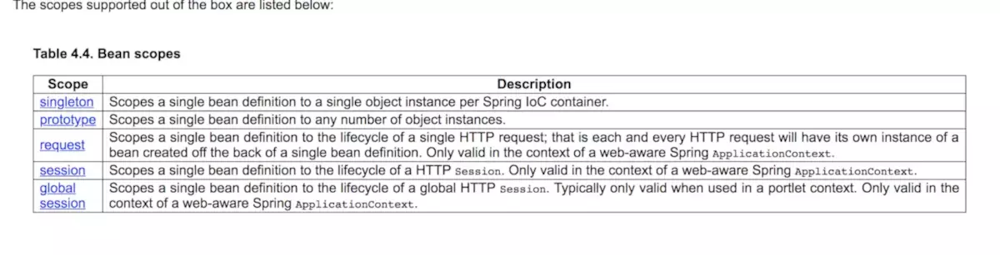
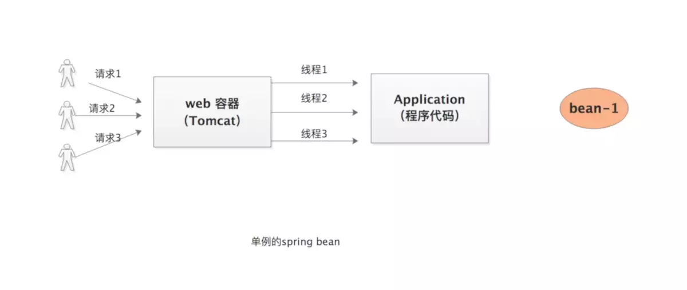
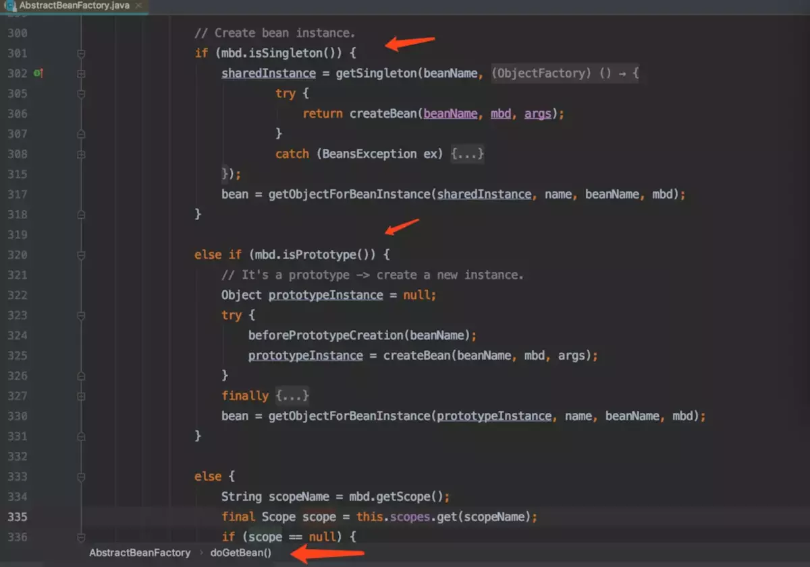
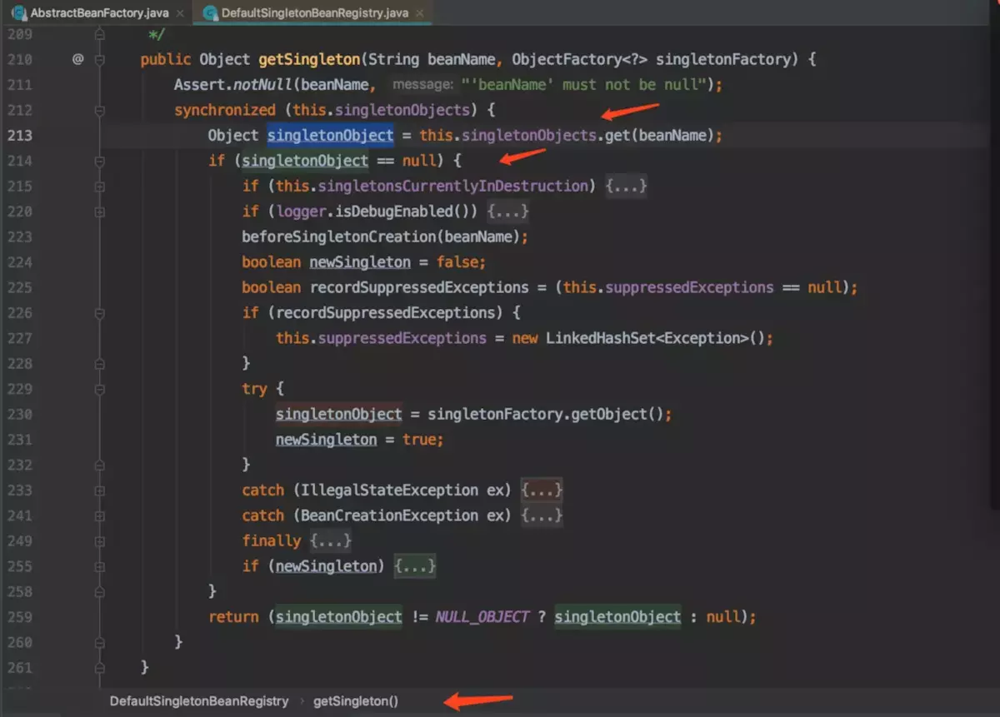

## Spring中指定Bean的作用于的方式

以下四种为例：

* 单例（默认，可以不用特殊表明）

  ```java
  @Scope(value = ConfigurableBeanFactory.SCOPE_SINGLETON)
  ```

* 多例

  ```java
  @Scope(value = ConfigurableBeanFactory.SCOPE_PROTOTYPE)
  ```

* session 

  ```java
  @Scope(value = WebApplicationContext.SCOPE_SESSION,        
         proxyMode = ScopedProxyMode.INTERFACES)
  ```

* request

  ```java
  @Scope(value = WebApplicationContext.SCOPE_REQUEST,        
         proxyMode = ScopedProxyMode.TARGET_CLASS)
  ```

> session和request类型的作用域时，如果需要将该对象注入到单例Bean中，需要指明代码模式
>
> ps: 如果注入的是接口类型的话：proxyMode使用INTERFACES即可，如果是时一个类时，则需要为TARGET_CLASS类型（这个表示使用CGLIB代理）


## spring中 bean在什么时候创建的？
singleton（单例）：只有一个共享的实例存在，所有对这个bean的请求都会返回这个唯一的实例。

此取值时表明容器中创建时只存在一个实例，所有引用此bean都是单一实例。如同每个国家都有一个总统，国家的所有人共用此总统，而这个国家就是一个spring容器，总统就是spring创建的类的bean，国家中的人就是其它调用者，总统是一个表明其在spring中的scope为singleton，也就是单例模型。

此外，singleton类型的bean定义从容器启动到第一次被请求而实例化开始，只要容器不销毁或退出，该类型的bean的单一实例就会一直存活，典型单例模式，如同servlet在web容器中的生命周期。

prototype（多例）：对这个bean的每次请求都会创建一个新的bean实例，类似于new。

spring容器在进行输出prototype的bean对象时，会每次都重新生成一个新的对象给请求方，虽然这种类型的对象的实例化以及属性设置等工作都是由容器负责的，但是只要准备完毕，并且对象实例返回给请求方之后，容器就不在拥有当前对象的引用，请求方需要自己负责当前对象后继生命周期的管理工作，包括该对象的销毁。也就是说，容器每次返回请求方该对象的一个新的实例之后，就由这个对象“自生自灭”。

懒加载bean使用： @Lazy
一般情况下，Spring容器在启动时会创建所有的Bean对象，使用@Lazy注解可以将Bean对象的创建延迟到第一次使用Bean的时候


## Spring 为啥默认把设计成单例的？
> 熟悉spring开发的朋友都知道spring 提供了5种scope分别是singleton, prototype, request, session,global session。如下图是官方文档上的截图，感兴趣的朋友可以进去看看这五种分别有什么不同。今天要介绍的是这五种中的前两种，也是spring最初提供的bean scope singleton 和 prototype。

spring 官方文档介绍如下图：



更多内容可以看官方文档介绍，非常详细：Spring bean作用域

* 单例bean与原型bean的区别
> 如果一个bean被声明为单例的时候，在处理多次请求的时候在spring 容器里只实例化出一个bean，后续的请求都公用这个对象，这个对象会保存在一个map里面。当有请求来的时候会先从缓存(map)里查看有没有，有的话直接使用这个对象，没有的话才实例化一个新的对象，所以这是个单例的。但是对于原型(prototype)bean来说当每次请求来的时候直接实例化新的bean，没有缓存以及从缓存查的过程。

1.画图分析



2.源码分析

生成bean时先判断单例的还是原型的



如果是单例的则先尝试从缓存里获取，没有在新创建



**结论：**

1.单例的bean只有第一次创建新的bean 后面都会复用该bean，所以不会频繁创建对象。

2.原型的bean每次都会新创建

### 单例bean的优势
由于不会每次都新创建新对象所以有一下几个性能上的优势： 
1.减少了新生成实例的消耗 新生成实例消耗包括两方面，第一，spring会通过反射或者cglib来生成bean实例这都是耗性能的操作，其次给对象分配内存也会涉及复杂算法

2.减少jvm垃圾回收 由于不会给每个请求都新生成bean实例，所以自然回收的对象少了

3.可以快速获取到bean 因为单例的获取bean操作除了第一次生成之外其余的都是从缓存里获取的所以很快

### 单例bean的劣势
单例的bean一个很大的劣势就是他**不能做到线程安全**！！！，由于所有请求都共享一个bean实例，所以这个bean要是有状态的一个bean的话可能在并发场景下出现问题，而原型的bean则不会有这样问题（但也有例外，比如他被单例bean依赖），因为给每个请求都新创建实例。

总结
Spring 为啥把bean默认设计成单例？
答案：为了提高性能！！！从几个方面，1.少创建实例2.垃圾回收3.缓存快速获取